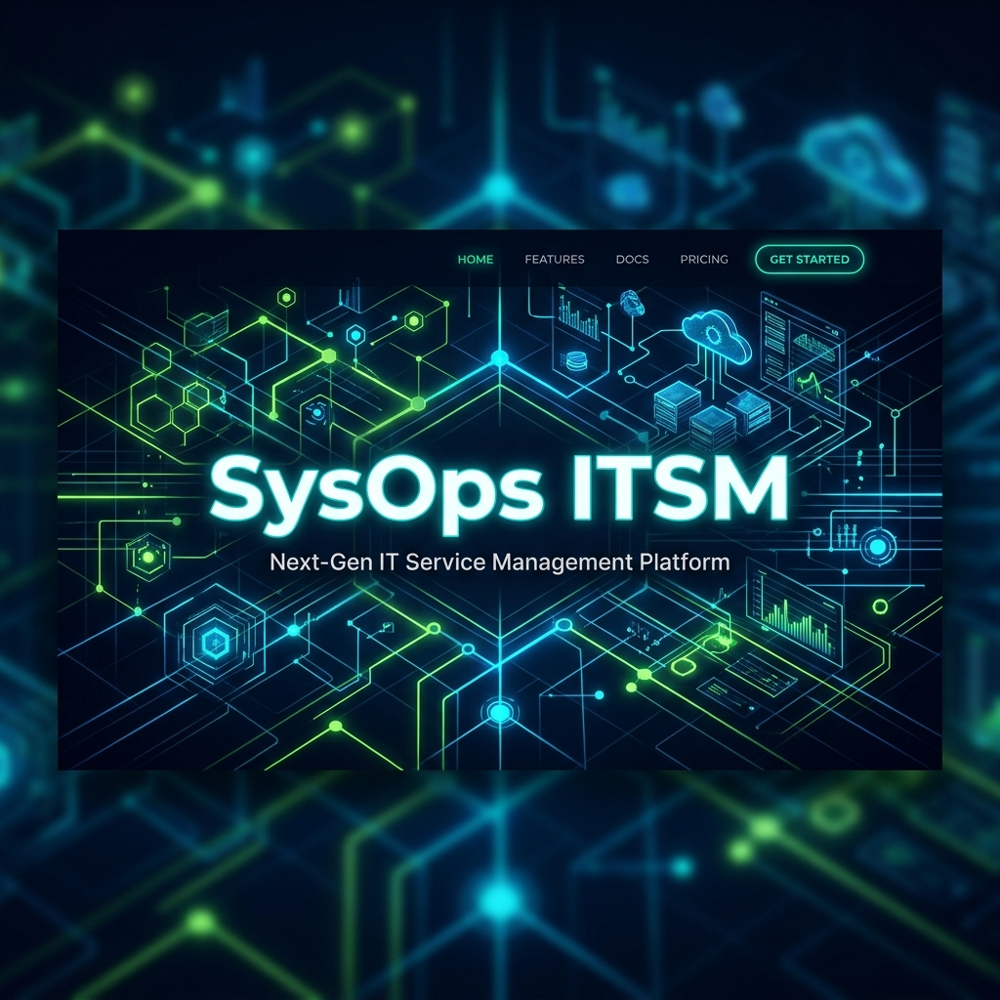
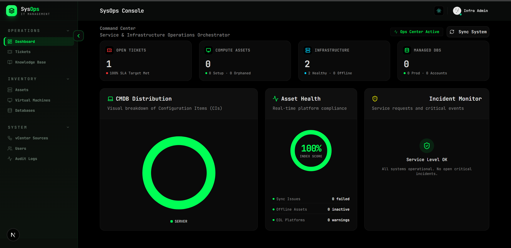

<div align="center">
  
</div>

# 🛡️ SysOps — Enterprise IT Service Management Hub

SysOps is a comprehensive, enterprise-grade **IT Service Management (ITSM)** platform designed to unify asset inventory, incident management, and infrastructure monitoring into a single, high-performance interface. 

Built with modern web technologies, SysOps delivers a premium user experience with real-time data syncing, dynamic visualizations, and deep infrastructure integrations.

<div align="center">
  
  
  
  
  
  
</div>

---

## 📸 Dashboard Preview

<div align="center">
  
</div>

---

## 🚀 Key Features

### 🎫 Service Delivery (Operations)
*   **Unified Ticketing System**: Streamlined incident reporting and request fulfillment with real-time SLA tracking.
*   **Knowledge Base**: Centralized, markdown-powered repository for technical documentation and self-service solutions.
*   **Command Center**: Real-time dashboard for service levels, system alerts, and infrastructure health monitoring.

### 🏢 Asset Management (Inventory)
*   **Modern CMDB (Configuration Management Database)**: Comprehensive tracking of Hardware, Virtual Machines, and Database lifecycles.
*   **Compute Orchestration**: Deep integration with vCenter for automated VM discovery, state tracking, and capacity planning.
*   **Data Inventory**: Automated mapping of database instances, connection tracking, and user access audits.

### 🔐 System & Security
*   **Role-Based Access Control (RBAC)**: Fine-grained permissions for IT staff, engineers, and administrators.
*   **Audit Logging**: Full traceability of all configuration changes, system access, and critical actions.
*   **Cyber UI**: Modern, high-performance interface with real-time micro-animations, glassmorphism, and a dedicated "Dark Mode" focus.

---

## 🛠️ Technical Stack

SysOps leverages a modern, robust, and scalable architecture to ensure maximum performance and developer experience.

### Frontend 💻
*   **Framework**: [Next.js 15+](https://nextjs.org/) (App Router, Turbopack)
*   **Styling**: [Tailwind CSS v4](https://tailwindcss.com/)
*   **UI Components**: [Radix UI](https://www.radix-ui.com/), [shadcn/ui](https://ui.shadcn.com/)
*   **Animations**: [Framer Motion](https://www.framer.com/motion/)
*   **State & Fetching**: Axios, React Context API

### Backend ⚙️
*   **Framework**: [NestJS](https://nestjs.com/)
*   **Database**: PostgreSQL
*   **ORM**: [Prisma](https://www.prisma.io/)
*   **Authentication**: JWT, bcrypt

### Infrastructure ☁️
*   **Containerization**: Docker & Docker Compose
*   **Integrations**: VMware vCenter API

---

## 🏁 Getting Started

To get a local instance of SysOps up and running, follow these simple steps.

### Prerequisites
*   Node.js (v20+)
*   Docker & Docker Compose
*   Git

### 1. Clone the repository
```bash
git clone https://github.com/somkid-s5/IT-Asset-Inventory.git
cd IT-Asset-Inventory
```

### 2. Environment Setup
Copy the example environment files and configure your secrets:
```bash
# Backend setup
cd backend
cp .env.example .env

# Frontend setup
cd ../frontend
cp .env.example .env
```

### 3. Start the Infrastructure (Database)
Spin up the required PostgreSQL database using Docker:
```bash
docker-compose up -d
```

### 4. Install Dependencies & Run Migrations
```bash
# In the backend directory
npm install
npx prisma migrate dev
npm run seed     # Optional: Seed the database with sample data
npm run start:dev

# In a new terminal, from the frontend directory
npm install
npm run dev
```

### 5. Access the Platform
Open your browser and navigate to: **`http://localhost:3000`**

---

<div align="center">
  <p>Developed with ❤️ for SysOps Professionals & Infrastructure Engineers.</p>
  <p><strong>Optimize. Automate. Scale.</strong></p>
</div>
